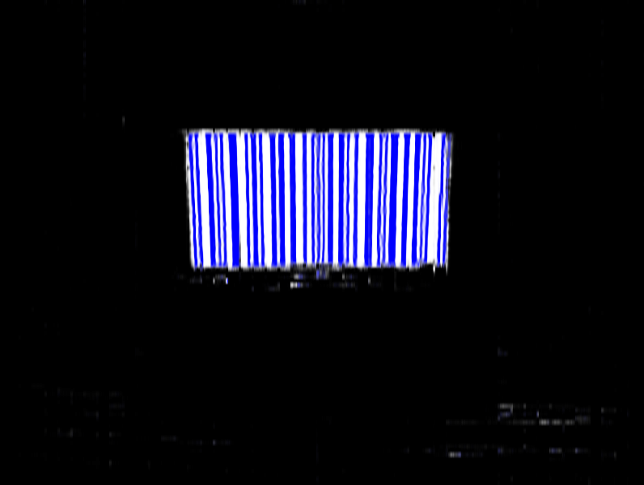

# acres
acres is a tool for sharpening barcodes. Specifically, it is an implementation of a convolutional neural network designed for preprocessing blurry images of 1D barcodes.

For details of the architecture and implementation, see [ARCHITECTURE.md](./ARCHITECTURE.md).

## Example
The network takes an image and performs segmentation; for every pixel, it tries to predict whether it is:

 - not a part of a barcode
 - a white bar
 - a black bar

### Input image

### Prediction

### Ground truth - what the network would output in the ideal case

Even though the image is heavily blurred, the network manages to extract a reasonable prediction.
